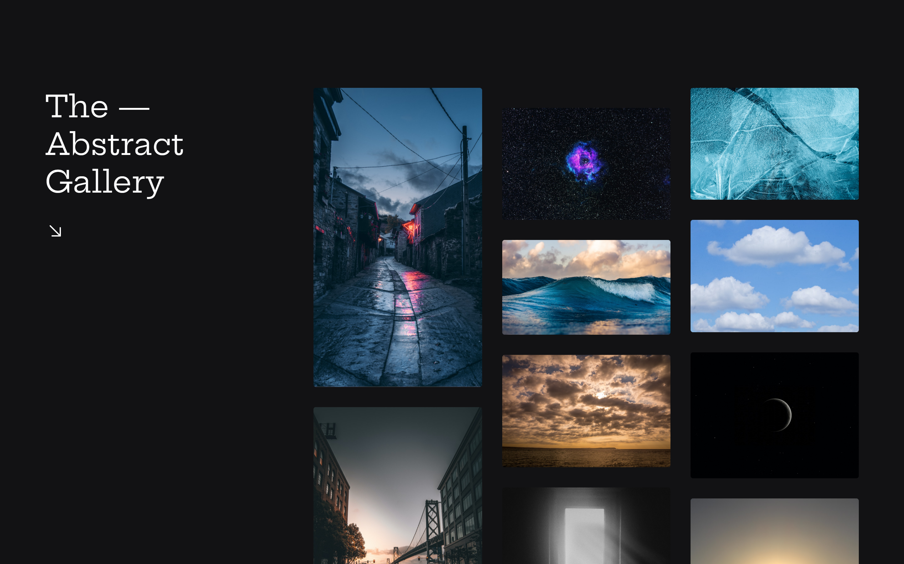

<h1 align="center"> Galeria com Hover - BoraCodar#20 </h1>

[Clique aqui para acessar](https://maik-emanoel.github.io/gallery/)

## 🚀 Tecnologias

Esse projeto foi desenvolvido com as seguintes tecnologias:

- HTML
- CSS
- JavaScript
- Git and GitHub

## 💻 Projeto

O projeto Galeria com Hover é uma galeria com layout Masonry (mais conhecido como Pinterest Layout) que traz imagens aleatórias dinamicamente. 

Projeto construído a partir do layout proposto no desafio [#BoraCodar20](https://boracodar.dev/) realizado pela [Rocketseat](https://rocketseat.com.br).
Após o desenvolvimento do projeto inicial, adicionei novas features, tais quais:

- Layout responsivo (Adaptado para telas menores);
- Imagens que são buscadas dinamicamente (através da URL do site Unsplash);
- Animações/efeitos hover;
- Entre outras pequenas modificações.